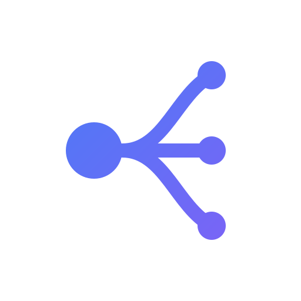

<div align="center">
  
  <h1>OneLook 一目</h1>
  <p><b>一目了然，思维如流</b></p>
  <p>极简、高效、现代化的 Web 端思维导图工具</p>
  
  <p>
    
    
    
    
  </p>
</div>

<br />

<div align="center">
  <a href="https://onelook.byebug.cn"><strong>🌐 在线体验</strong></a> &nbsp;•&nbsp;
  <a href="https://onelookdocs.byebug.cn"><strong>📖 使用文档</strong></a> &nbsp;•&nbsp;
  <a href="https://github.com/QingJ01/onelook"><strong>⭐ GitHub</strong></a>
</div>

<br />

OneLook 是一款专注于**沉浸式创作**的思维导图应用。它摒弃了繁杂的 UI 干扰，结合了 Markdown 的流畅输入与 SVG 的高性能渲染，为您提供所见即所得的思考空间。数据完全存储于本地，隐私无忧。

## ✨ 核心特性

- 📝 **所见即所得**：支持标准 Markdown 语法与 LaTeX 数学公式 (`$E=mc^2$`) 实时预览。
- 🎨 **现代化设计**：内置多种精美主题（亮色/暗色/清新），支持圆角/连线风格深度定制。
- 🌈 **彩虹分支**：一键开启，为不同主分支自动着色，思维脉络一目了然。
- 🎬 **演说模式**：Prize 风格的沉浸式演示，智能运镜、视觉聚焦、激光笔一应俱全。
- 🚀 **无限画布**：基于 D3.js 的智能布局算法，支持无限缩放、拖拽与平滑自动居中。
- ⚡ **高效交互**：全键盘快捷键驱动，支持多选 (Ctrl+Click)、框选 (Shift+Drag) 与批量操作。
- 📂 **本地优先**：基于 IndexedDB 的本地持久化存储，无需联网；支持多标签页管理。
- 📤 **多格式导出**：支持导出为高清 PNG、矢量 SVG、Markdown 列表及专属 `.olook` 格式。


## 🛠️ 技术栈

- **Core**: Vue 3 (Composition API) + TypeScript
- **Build**: Vite + PostCSS
- **State**: Pinia
- **Icons**: Lucide Vue
- **Rendering**: SVG + D3.js (Algorithms)
- **Rich Text**: Marked (Markdown) + KaTeX (Formula)
- **Storage**: Dexie.js (IndexedDB)
- **Docs**: VitePress

## 📂 目录结构

```bash
src/
├── components/     # Vue 组件
│   ├── editor/     # 编辑器核心 (Canvas, Node, Toolbar...)
│   └── ...
├── composables/    # 组合式函数 (useHistory, useSelection...)
├── core/           # 核心逻辑
│   └── layout/     # 布局算法 (MindLayouter)
├── services/       # 服务层 (Dexie DB, Export)
├── stores/         # Pinia 状态仓库 (mapStore)
├── types/          # TS 类型定义
└── utils/          # 工具函数
    ├── latex.ts    # LaTeX 渲染
    └── markdown.ts # Markdown 渲染
```

## 🗺️ Roadmap (V2)

- [x] **Core**: 基础思维导图、多布局切换、Markdown & LaTeX 支持
- [x] **UX**: 全键盘快捷键、多选/框选、自动居中、暗黑模式
- [x] **Quality**: 导入数据验证、导出 Loading 提示、IME 兼容优化
- [x] **彩虹分支**: 一键开启，主分支自动着色
- [x] **Pitch Mode**: 演说模式，智能运镜、视觉聚焦、激光笔
- [ ] **Import+**: XMind、OPML 等更多专业格式导入支持
- [ ] **AI Assistant**: 接入 LLM，支持自然语言一键生成导图、节点扩写与总结
- [ ] **PWA**: 深度支持离线使用与桌面安装

## 🤝 贡献指南

我们非常欢迎社区贡献！如果您想参与开发：

1. Fork 本仓库
2. 创建您的特性分支 (`git checkout -b feature/AmazingFeature`)
3. 提交您的修改 (`git commit -m 'Add some AmazingFeature'`)
4. 推送到分支 (`git push origin feature/AmazingFeature`)
5. 提交 Pull Request


## 📦 快速开始

### 环境要求
- Node.js >= 16.0
- pnpm >= 8.0

### 安装运行

```bash
# 1. 克隆项目
git clone https://github.com/your-username/onelook.git

# 2. 进入目录
cd onelook

# 3. 安装依赖
pnpm install

# 4. 启动开发服务器
pnpm dev
# 访问 http://localhost:5173
```

### 文档预览

本项目包含完整的用户使用手册（基于 VitePress）：

```bash
# 启动文档服务器
pnpm docs:dev
# 访问 http://localhost:5173 (端口可能不同)
```

## 💬 交流与反馈

欢迎加入 OneLook 官方 QQ 交流群：**1081533635**

[点击一键加入 QQ 群](http://qm.qq.com/cgi-bin/qm/qr?_wv=1027&k=DSrAYoXsT_GwfKIyeb_X83s1ub3Q5NCg)


## 📄 许可证

本项目基于 [MIT License](./LICENSE) 开源。
